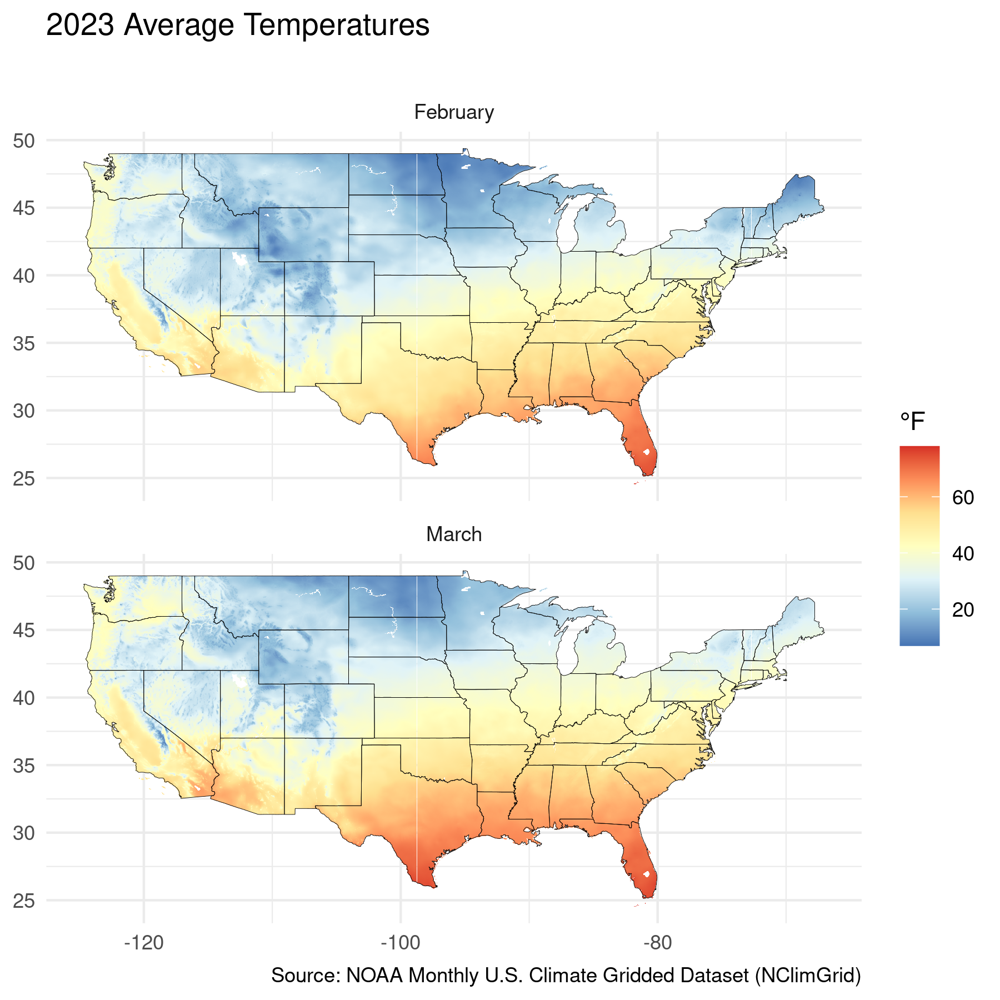
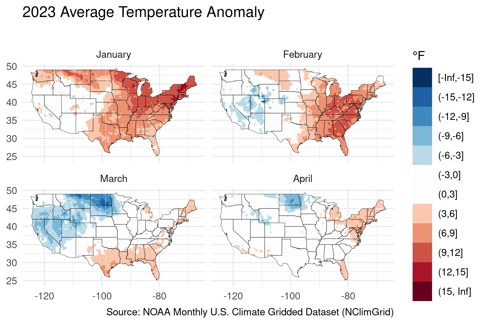

<!-- README.md is generated from README.Rmd. Please edit that file -->

<!-- # noaaclimgrid  -->

## Overview

R tools to fetch and visualize [NOAA’s](https://www.noaa.gov) Monthly
U.S. Climate Gridded Dataset
([NClimGrid](https://www.ncei.noaa.gov/access/metadata/landing-page/bin/iso?id=gov.noaa.ncdc:C00332)).
This package is not created or maintained by NOAA.

  - `get_nclimgrid_monthly()` (add description)
  - `get_nclimgrid_normals()` (add description)
  - `compute_anomaly()` (add description)

Some plotting functions are included to visualize measurements and
anomalies:

  - `plot_nclimgrid_monthly()` (add description)
  - `plot_nclimgrid_anomaly()` (add description)
  - `plot_nclimgrid_distribution()` (add description)

## Installation

``` r

# Development version from GitHub:
devtools::install_github("toozler/noaa_nclimgrid_r")
```

## Usage

### Fetching and manipulating data

[NOAA](https://www.noaa.gov) stores the nClimGrid dataset in yearly
files containing all months (up to previous month for the current year).
The `get_nclimgrid_*()` functions fetch this data and perform some basic
parsing:

``` r
nclim_monthly_data <- get_nclimgrid_monthly(year = 2021, measurement = "tave", region = "conus", wide = FALSE, verbose = FALSE)

str(nclim_monthly_data)
#> tibble [5,637,096 × 4] (S3: tbl_df/tbl/data.frame)
#>  $ lat  : num [1:5637096] 24.6 24.6 24.6 24.6 24.6 ...
#>  $ long : num [1:5637096] -81.8 -81.8 -81.8 -81.8 -81.8 ...
#>  $ month: Factor w/ 12 levels "1","2","3","4",..: 1 2 3 4 5 6 7 8 9 10 ...
#>  $ value: num [1:5637096] 69.5 75.4 76.2 79.1 81 ...
#>  - attr(*, "year")= num 2021
#>  - attr(*, "measurement")= chr "tave"
#>  - attr(*, "region")= chr "conus"
#>  - attr(*, "unit")= chr "Fahrenheit"
#>  - attr(*, "wide")= logi FALSE
#>  - attr(*, "anomaly_df")= logi FALSE
```

The example above pulls average temperature (“tave”) for the Continental
US (“conus”) in 2021. Available datasets include also “tmin” (minimum
temperatures), “tmax” (maximum temperatures) and “prcp” (precipitation).
More details about the nClimGrid dataset are available
[here](https://www.ncei.noaa.gov/access/metadata/landing-page/bin/iso?id=gov.noaa.ncdc:C00332).
As default, the data frame is converted to a long format for easier
integration with [tidyverse](http://tidyverse.org/) packages.

``` r
nclim_normals_data <- get_nclimgrid_normals(period = "1901-2000", measurement = "tave", region = "conus")

str(nclim_normals_data)
#> tibble [5,637,096 × 4] (S3: tbl_df/tbl/data.frame)
#>  $ lat  : num [1:5637096] 24.6 24.6 24.6 24.6 24.6 ...
#>  $ long : num [1:5637096] -81.8 -81.8 -81.8 -81.8 -81.8 ...
#>  $ month: Factor w/ 12 levels "1","2","3","4",..: 1 2 3 4 5 6 7 8 9 10 ...
#>  $ value: num [1:5637096] 69.4 70 72.6 76.3 79.6 ...
#>  - attr(*, "period")= chr "1901-2000"
#>  - attr(*, "measurement")= chr "tave"
#>  - attr(*, "region")= chr "conus"
#>  - attr(*, "unit")= chr "Fahrenheit"
#>  - attr(*, "wide")= logi FALSE
#>  - attr(*, "anomaly_df")= logi FALSE
```

The above example will pull the normals (typical values) for a given set
of available periods of record. By default, “1901-2000” (20th Century)
is used. Other available periods can be listed with
`validate_normals_period()`

``` r
tave_anomaly <- compute_anomaly(monthly_data = nclim_monthly_data, 
                                normals_data = nclim_normals_data)

str(tave_anomaly)
#> tibble [5,637,096 × 4] (S3: tbl_df/tbl/data.frame)
#>  $ lat    : num [1:5637096] 24.6 24.6 24.6 24.6 24.6 ...
#>  $ long   : num [1:5637096] -81.8 -81.8 -81.8 -81.8 -81.8 ...
#>  $ month  : Factor w/ 12 levels "1","2","3","4",..: 1 2 3 4 5 6 7 8 9 10 ...
#>  $ anomaly: num [1:5637096] 0.128 5.434 3.588 2.816 1.442 ...
#>  - attr(*, "year")= num 2021
#>  - attr(*, "measurement")= chr "tave"
#>  - attr(*, "region")= chr "conus"
#>  - attr(*, "unit")= chr "Fahrenheit"
#>  - attr(*, "wide")= logi FALSE
#>  - attr(*, "anomaly_df")= logi TRUE
```

Same measurement type datasets (i.e. temperature or precipitation) can
be compared by using the `compute_anomaly()` function, which returns the
difference between the two datasets. Months not present on the LHS are
not included (i.e. your monthly measurements only cover a few months of
the year).

### Visualization

You can visualize measurement values from monthly or normals with
`plot_nclimgrid_monthly()`.

``` r
plot_measurement_data(nclim_monthly_data, 
                      facet_cols = 1, 
                      subset_months = 2:4, 
                      title = "Average Temperature", subtitle = "Continental US, 2021", 
                      show_credit = T)
```



You can visualize measurement values from monthly or normals with
`plot_nclimgrid_distribution()`.


