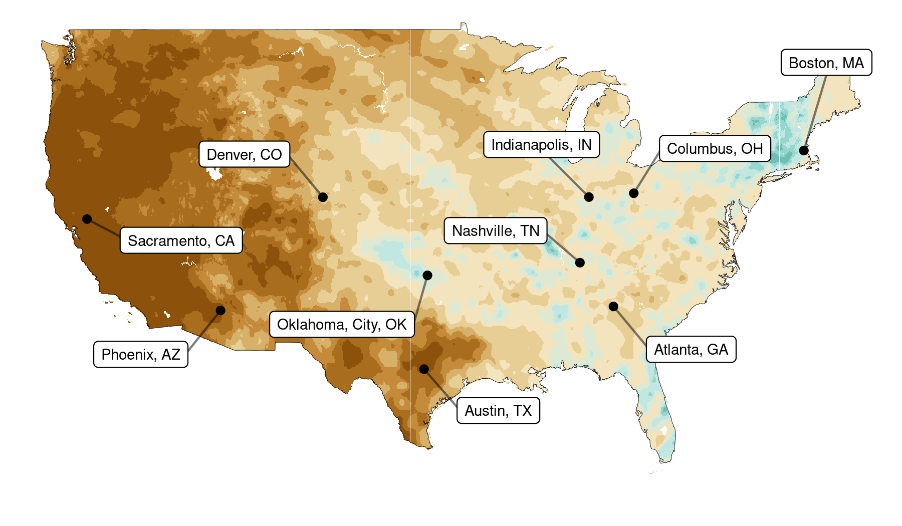
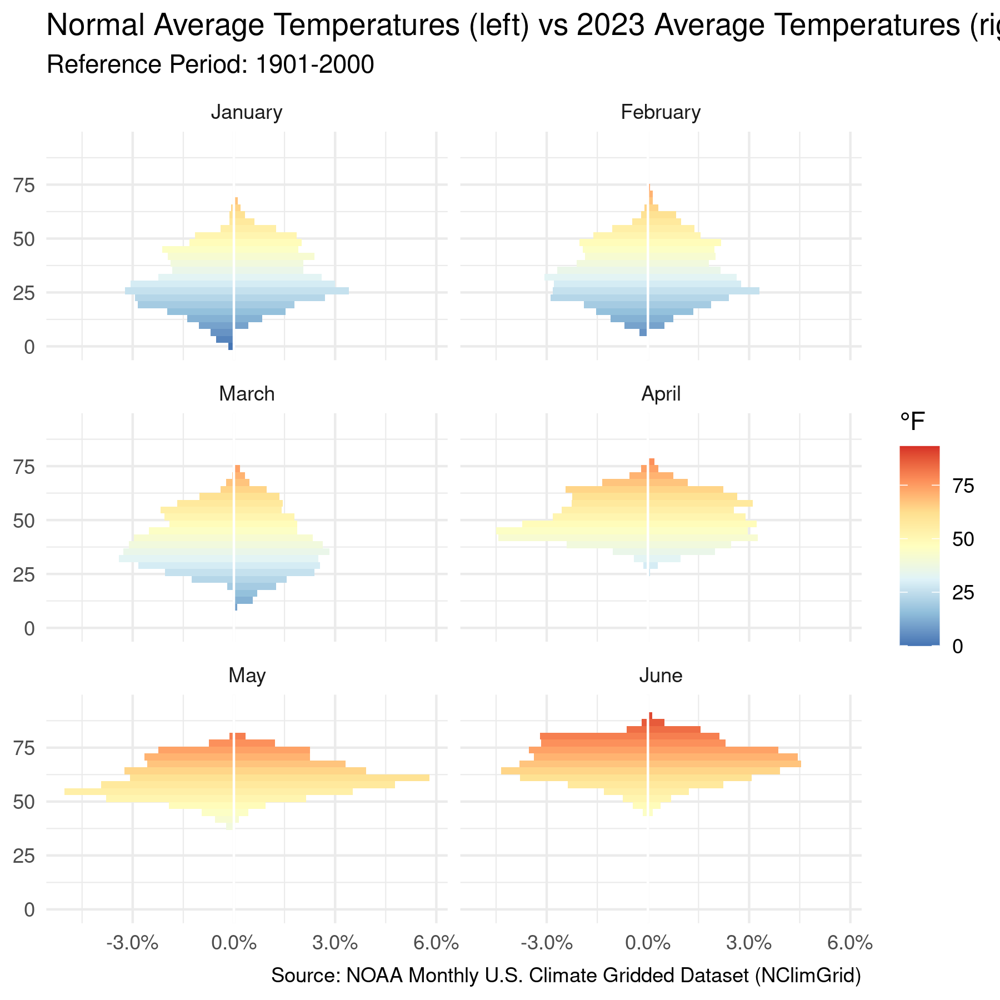

<!-- README.md is generated from README.Rmd. Please edit that file -->

# noaaclimgrid 

## Overview

R tools to fetch and visualize [NOAA’s](https://www.noaa.gov) Monthly
U.S. Climate Gridded Dataset
([NClimGrid](https://www.ncei.noaa.gov/access/metadata/landing-page/bin/iso?id=gov.noaa.ncdc:C00332)):

> The NOAA Monthly U.S. Climate Gridded Dataset (NClimGrid) consists of
> four climate variables derived from the GHCN-D dataset: maximum
> temperature, minimum temperature, average temperature and
> precipitation. Each file provides monthly values in a 5x5 lat/lon grid
> for the Continental United States. Data is available from 1895 to the
> present.

Basic functions include:

  - `get_nclimgrid_monthly()` Downloads and formats nClimGrid monthly
    data for recent years
  - `get_nclimgrid_normals()` Downloads and formats nClimGrid normals
    data for ranges of period of record
  - `compute_anomaly()` Computes the difference between two datasets of
    the same measurement type

Some plotting functions are included to visualize measurements and
anomalies:

  - `plot_nclimgrid()` Creates a monthly faceted plot of measurement
    (either monthly or normals) or anomaly
  - `plot_nclimgrid_histogram()` Creates a histogram (if evaluating one
    dataset) or mirrored histogram (if comparing two datasets)

This package is not created or maintained by NOAA.

## Installation

``` r
# Development version from GitHub:
devtools::install_github("toozler/noaa_nclimgrid_r")
```

## Usage

### Fetching and manipulating data

[NOAA](https://www.noaa.gov) stores the nClimGrid dataset in yearly
files containing all months (up to previous month for the current year).
The `get_nclimgrid_*()` functions fetch this data and perform some basic
parsing:

``` r
nclim_monthly_data <- get_nclimgrid_monthly(year = 2021, 
                                            measurement = "tave", 
                                            region = "conus", 
                                            wide = FALSE, 
                                            verbose = FALSE)
nclim_monthly_data %>% str
#> tibble [5,637,096 × 4] (S3: tbl_df/tbl/data.frame)
#>  $ lat  : num [1:5637096] 24.6 24.6 24.6 24.6 24.6 ...
#>  $ long : num [1:5637096] -81.8 -81.8 -81.8 -81.8 -81.8 ...
#>  $ month: Factor w/ 12 levels "1","2","3","4",..: 1 2 3 4 5 6 7 8 9 10 ...
#>  $ value: num [1:5637096] 69.5 75.4 76.2 79.1 81 ...
#>  - attr(*, "year")= num 2021
#>  - attr(*, "measurement")= chr "tave"
#>  - attr(*, "region")= chr "conus"
#>  - attr(*, "unit")= chr "Fahrenheit"
#>  - attr(*, "wide")= logi FALSE
#>  - attr(*, "anomaly_df")= logi FALSE
```

The example above pulls average temperature (`tave`) for the Continental
US (`conus`) in 2021. Available datasets include also `tmin` (minimum
temperatures), `tmax` (maximum temperatures) and `prcp` (precipitation).
More details about the nClimGrid dataset are available
[here](https://www.ncei.noaa.gov/access/metadata/landing-page/bin/iso?id=gov.noaa.ncdc:C00332).
As default, the data frame is converted to a long format for easier
integration with [tidyverse](http://tidyverse.org/) packages. Metadata
is stored in each data frame as attributes.

``` r
nclim_normals_data <- get_nclimgrid_normals(period = "1901-2000", 
                                            measurement = "tave", 
                                            region = "conus")
```

The above example will pull the normals (typical values) for a given set
of available periods of record. By default, “1901-2000” (20th Century)
is used. Other available periods can be listed with
`validate_normals_period()`

``` r
tave_anomaly <- compute_anomaly(monthly_data = nclim_monthly_data, 
                                normals_data = nclim_normals_data)

tave_anomaly %>% str
#> tibble [5,637,096 × 4] (S3: tbl_df/tbl/data.frame)
#>  $ lat  : num [1:5637096] 24.6 24.6 24.6 24.6 24.6 ...
#>  $ long : num [1:5637096] -81.8 -81.8 -81.8 -81.8 -81.8 ...
#>  $ month: Factor w/ 12 levels "1","2","3","4",..: 1 2 3 4 5 6 7 8 9 10 ...
#>  $ value: num [1:5637096] 0.128 5.434 3.588 2.816 1.442 ...
#>  - attr(*, "year")= num 2021
#>  - attr(*, "measurement")= chr "tave"
#>  - attr(*, "region")= chr "conus"
#>  - attr(*, "unit")= chr "Fahrenheit"
#>  - attr(*, "wide")= logi FALSE
#>  - attr(*, "anomaly_df")= logi TRUE
```

Same measurement type datasets (i.e. temperature or precipitation) can
be compared by using the `compute_anomaly()` function, which returns the
difference between the two datasets. Months not present on the LHS are
not included (i.e. your monthly measurements only cover a few months of
the year).

### Visualization

You can visualize nClimGrid data with `plot_nclimgrid()`. The month
column is automatically faceted as only one month can be displayed per
each map. Values are automatically labelled with the month’s name. A
default title and subtitle (where applicable) is generated based on the
data being plotted.

``` r
nclim_monthly_data %>% 
  filter(month %in% 2:3) %>% 
  plot_nclimgrid(facet_cols = 1, 
                 show_credit = T)
```


Anomalies can be visualized by plotting the output of
`compute_anomaly()`.

``` r
temperature_anomaly <- compute_anomaly(nclim_monthly_data, 
                                       nclim_normals_data)

temperature_anomaly %>% 
  filter(month %in% 1:4) %>% 
  plot_nclimgrid(facet_col = 2)
```


The output of the plotting function is a `ggplot2` object, which allows
you tack on additional `geoms` (i.e. to add features like points and
labels), to remove features (i.e. remove titles and facet labels) or to
modify features (i.e. theme options):

``` r
require(maps)
#> Loading required package: maps
require(ggrepel)
#> Loading required package: ggrepel

nclim_monthly_prcp_data <- get_nclimgrid_monthly(year = 2021, 
                                                 measurement = "prcp", 
                                                 region = "conus")
large_us_capitals <- maps::us.cities %>% 
  filter(capital != 0, pop >= 400000) %>% 
  mutate(name = gsub(" ", ", ", name))

nclim_monthly_prcp_data %>%
  filter(month %in% 7) %>%
  plot_nclimgrid(show_credit = F, show_states = F) +
  geom_point(data = large_us_capitals, aes(x=long, y=lat)) +
  geom_label_repel(data = large_us_capitals, aes(x=long, y=lat, label=name),
                    box.padding = 1, segment.alpha = 0.5, size = 3) +
  labs(title = NULL, 
       subtitle = NULL) +
  theme_void() +
  theme(legend.position = 'none', 
        strip.text = element_blank())
```



You can visualize and compare the distribution of values from monthly or
normals datasets with `plot_nclimgrid_histogram()`.



## Future features

  - Subset data by state or region
  - Fetch data from nClimGrid’s
    [archive]( "https://www.ncei.noaa.gov/pub/data/climgrid/") of
    monthly data from 1895 onwards.
